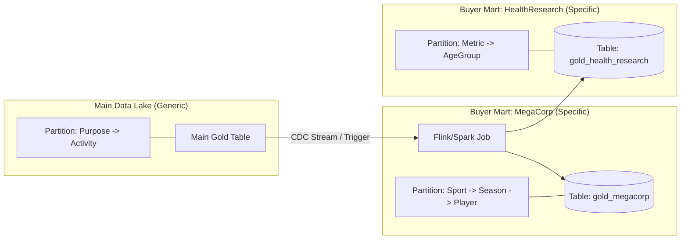

# Design Deep Dive: Architecture & Physical Partitioning

## 1. End-to-End Architecture

**Description**: This diagram illustrates the data journey from ingestion to consumption, highlighting the strict separation of duties between Ingestion, Processing, and Serving.

```mermaid
graph TD
    %% --- Sources ---
    subgraph "1. Ingestion Sources"
        App[Mobile App API]
        Wearable[Whoop/Garmin API]
        Socket[Live Telemetry Socket]
        Batch[Historic File Upload]
    end

    %% --- Bronze Layer ---
    subgraph "2. Raw Ingestion (Bronze Layer)"
        IngestAPI[Ingestion Service]
        KafkaRaw[Kafka Topic: telemetry.raw]
        BronzeBucket[(MinIO: Bronze Bucket)]
        
        App --> IngestAPI
        Wearable --> IngestAPI
        Socket --> IngestAPI
        Batch --> IngestAPI
        
        IngestAPI -->|Ack & Buffer| KafkaRaw
        IngestAPI -->|Archive| BronzeBucket
        KafkaRaw --> FlinkJob
    end

    %% --- Stream Processing ---
    subgraph "3. Policy & Processing Engine (Silver Layer)"
        FlinkJob[Flink: Enrichment & Cleaning]
        SchemaRegistry[Schema Registry]
        SilverBucket[(MinIO: Silver Bucket)]
        
        FlinkJob -->|Validate| SchemaRegistry
        FlinkJob -->|Standardize| SilverBucket
        SilverBucket --> ConsentEnforcer
    end

    %% --- Gold Layer (The Fan-Out) ---
    subgraph "4. Consent Enforcement (Gold Layer)"
        ConsentEnforcer[Enforcer Job (Flink/Spark)]
        RuleEngine[Policy Engine (OPA)]
        ConsentDB[(Redis: Consent Rules)]
        
        RulesAPI[Consent Mgmt API] -->|Update| ConsentDB
        ConsentDB -.->|Sync| RuleEngine
        
        ConsentEnforcer -->|Query Rule| RuleEngine
        
        ConsentEnforcer -->|Research Allowed?| PathRes[Part: Purpose=Research]
        ConsentEnforcer -->|Marketing Allowed?| PathMkt[Part: Purpose=Marketing]
        ConsentEnforcer -->|Edu Allowed?| PathEdu[Part: Purpose=Education]
    end

    %% --- Serving ---
    subgraph "5. Serving & Consumption"
        Trino[Trino Query Engine]
        BuyerAPI[Buyer API]
        
        PathRes --- Trino
        PathMkt --- Trino
        PathEdu --- Trino
        
        BuyerRes[Buyer: Research Inst] --> BuyerAPI
        BuyerMkt[Buyer: Ad Agency] --> BuyerAPI
        
        BuyerAPI -->|SQL: Select * from Gold where purpose='research'| Trino
    end

    %% --- Re-Indexing Loop ---
    subgraph "6. Dynamic Re-Indexing"
        ConsentEvent[Kafka: Consent-Changed]
        ReIndexWorker[Backfill Worker]
        
        RulesAPI -->|Publish| ConsentEvent
        ConsentEvent --> ReIndexWorker
        ReIndexWorker -->|Read History| SilverBucket
        ReIndexWorker -->|Rewash| ConsentEnforcer
    end
```

### Flow Description
1.  **Ingestion:** Diverse sources send data. We immediately archive to **Bronze** (for safety) and push to **Kafka** (for speed).
2.  **Silver Processing:** Flink cleans the data, standardizes schemas (e.g., converts Whoop JSON to standard format), and writes to **Silver**. This is our "Clean Source of Truth".
3.  **Gold Fan-Out (The Core Logic):**
    *   The **Enforcer Job** reads cleaned Silver data.
    *   It checks the **Policy Engine** (fueled by Redis Rules).
    *   If Rule says "Yes", it writes data to the specific **Purpose Folder** in Gold.
    *   Data is physically duplicated: One copy in `Purpose=Research`, another in `Purpose=Education`.
4.  **Serving:**
    *   Buyers hit the API. The API uses Trino/Iceberg to read *only* the specific Purpose folder.
    *   Zero computation is done here. It's just file reading.
5.  **Re-Indexing:**
    *   If a user changes consent, a **Backfill Worker** wakes up.
    *   It grabs historical data from **Silver**, re-runs the Enforcer, and updates the **Gold** folders (Add/Delete files).

---

## 2. Physical Partitioning (The "Fan-Out" Model)

In this model, "consent enforcement" happens during the **Write** process. We physically separate data into different folders based on **Purpose** first (Primary Security Boundary), and then sub-partition by **Activity/Event/Time** (Secondary Query Optimization).

### A. Hierarchical Folder Structure (Apache Iceberg)

To achieve N*N filtering, we define a composite partition spec. 

**1. Iceberg Partition Spec (Technical Definition)**
```java
PartitionSpec.builderFor(schema)
    .identity("purpose")        // 1. Primary Security Boundary
    .identity("activity")       // 2. Optimization for Activity Type
    .identity("event_context")  // 3. Optimization for Specific Events
    .day("timestamp")           // 4. Time Partitioning (Daily buckets)
    .build();
```

**2. Resulting Directory Layout**
This spec physically organizes files on S3/MinIO like this:
```text
s3://gold-bucket/data/
  ├── purpose=research/
  │   ├── activity=running/
  │   │   ├── event_context=training/
  │   │   │   ├── timestamp_day=2025-02-01/
  │   │   │   │   └── 0001-partition.parquet  <-- Physical Data File
  │   │   │   └── timestamp_day=2025-02-02/
  │   │   └── event_context=marathon_2025/    <-- Different Event
  │   │       └── ...
  │   └── activity=cycling/
  │       └── ...
  ├── purpose=marketing/
      └── ...
```

### B. Handling "New Dimensions" (Partition Evolution & Z-Order)

**1. Manual Index Control (Partition Evolution)**

*Concept:* You can change the physical layout of the table **at any time** to adapt to new query patterns. This is a metadata operation and does NOT require rewriting old data (0% downtime).

**Step-by-Step Evolution Scenario:**

*   **Phase 1 (Initial Config)**: Partitioned by `activity`.
    ```sql
    CREATE TABLE gold ... PARTITIONED BY (purpose, activity, day(ts));
    -- User queries: "Give me Running data" -> Fast.
    -- User queries: "Give me data for Sport=Football" -> Slow (must scan all activities).
    ```

*   **Phase 2 (The Pattern Shift)**: You observe Buyers querying by `sport`. You decide to maximize performance for `sport`.
    ```sql
    -- Execute on the fly:
    ALTER TABLE gold ADD COLUMN sport String;
    ALTER TABLE gold SET PARTITION SPEC ADD identity(sport);
    -- Now: New data is physically grouped by Sport.
    ```

**Hybrid Physical Layout (How Iceberg manages it):**
The Query Engine automatically merges both layouts transparently.
```text
s3://gold/
  ├── purpose=research/
  │   ├── activity=running/
  │   │   ├── day=2025-01-01/
  │   │   │   └── data_v1.parquet  <-- Old Layout (sport=null implicit)
  │   │
  │   ├── sport=football/          <-- New Layout (Takes priority for new data)
  │   │   ├── activity=running/
  │   │   │   ├── day=2025-06-01/
  │   │   │   │   └── data_v2.parquet
```

*   **Query**: `SELECT * WHERE sport='football'`
    *   **Engine Logic**:
        *   For **New Files**: Directly scan `sport=football/` folder. (Fast)
        *   For **Old Files**: It knows `sport` didn't exist, so it must inspect the old file metadata (manifests) to see if they *might* match (or skip if min/max stats exclude it).

### C. Buyer-Specific Sub-Layers (The "Data Mart" Pattern)

*Concept:* For a specific large buyer or restricted use-case, we fork a dedicated, physically isolated table. This is the ultimate "Gold" standard for performance and SLA isolation.

**Architecture: The "Stream-to-Mart" Flow**



**Implementation Details:**

1.  **Definition**: Create a new Iceberg table `gold_megacorp`.
    *   `PARTITIONED BY (sport, season, player_id)` <- Totally different from Main Gold.
2.  **Population (Sync)**:
    *   **Option A (Batch)**: Nightly `INSERT OVERWRITE gold_megacorp SELECT * FROM gold WHERE buyer_list CONTAINS 'MegaCorp'`.
    *   **Option B (Streaming)**: As data lands in Main Gold, a Flink job verifies "Is this allowed for MegaCorp?" -> Write to `gold_megacorp`.
3.  **Serving**:
    *   MegaCorp API Token is mapped strictly to query `gold_megacorp`.
    *   **Zero Interference**: MegaCorp can run `SELECT *` (Full Scan) and it only scans *their* small table, never touching the Petabytes of other data.

---

### D. Write Path Logic (The "Fan-Out" with Dimensions)
When the **Consent Enforcer** processes a record:
`{ "athleteId": "A1", "activity": "running", "event": "training", "hr": 140, "date": "2025-02-01" }`

1.  **Fetch Rule**: "Allow **Research** (All Activities) AND **Marketing** (Only Running)".
2.  **Evaluation & Routing**:
    *   **Research**: ALLOWED.
        *   -> Write to `gold/active/purpose=research/activity=running/event_context=training/timestamp_day=2025-02-01/`
    *   **Marketing**: ALLOWED (Active Check `running` == `running`).
        *   -> Write to `gold/active/purpose=marketing/activity=running/event_context=training/timestamp_day=2025-02-01/`
    *   **Education**: DENIED.
        *   -> Skip.

3.  **Result**: The record is physically duplicated into the appropriate deep folder structures for every allowed purpose.

---

## 3. Serving Data (The "Zero-Latency" Read)

Because the hard work (filtering) was done at write time, the **Read API** is incredibly simple and fast.

**Scenario**: Buyer wants `Research` data for `user123`.

1.  **API Call**: `GET /query?purpose=research&athlete=user123`
2.  **Lookup**: Construct path -> `s3://gold/active/purpose=research/athlete=user123/*`
3.  **Response**: Return all files in that folder.

**Why Zero Latency?**
*   **No Logic**: The API doesn't check "Is HR < 95?". It assumes if the file is in the `research` folder, it's valid.
*   **No Joins**: No joining against a User Table or Redis Control Plane at query time.
*   **Massive Throughput**: You are just streaming pre-computed files.

---

## 4. Dynamic Re-Indexing (Handling Consent Changes)

The key challenge: **"What if `user123` changes consent?"**

Since we duplicated data, we must update the physical files. We use an **Event-Driven Reconciliation** process.

### Scenario A: Revocation (Granular Delete)
*User says: "Stop using my data for Research!"*

1.  **Event**: `ConsentChanged: { athlete: user123, action: REVOKE, purpose: research }`
2.  **Re-Indexer Job** triggers immediately.
3.  **Action**:
    *   Target Path: `gold/active/purpose=research/athlete=user123/`
    *   Operation: **MOVE** folder to `gold/history/revoked/purpose=research/athlete=user123/`
4.  **Result**: Instant removal. The next API call finds an empty/missing folder (404).

### Scenario B: Re-Grant / New Rules (Backfill)
*User says: "Actually, you can use my data for Research now." (or adds a new rule)*

1.  **Event**: `ConsentChanged: { athlete: user123, action: GRANT, purpose: research }`
2.  **Re-Indexer Job** triggers.
3.  **Source**: It must go back to the **Silver Layer** (The clean source of truth).
4.  **Action (Backfill)**:
    *   Scan `silver/athlete=user123/*` for the valid time range.
    *   Re-run **only** the `Research` evaluation logic against this specific athlete's data.
    *   If records match the new rule (e.g., `HR < 95`), Write them to `gold/active/purpose=research/athlete=user123/`.
5.  **Result**: Data "appears" in the Research folder over time as the backfill job completes.

### The "Cost" of Fan-Out
*   **Storage Space**: Yes, data is duplicated. (1TB Silver -> 3TB Gold if 3 purposes avg).
*   **Trade-off**: Storage is cheap (S3). Compute/Latency at Read time is expensive. We pay with Storage to buy Speed.
