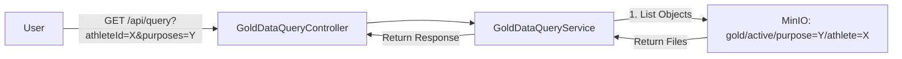

# Implementation Plan: Phase 3 - Consent-Aware Data Retrieval
**Date:** January 04, 2026  
**Status:** ✅ COMPLETED  
**Previous Context:** [`implementation_plan_2025_12_31.md`](file:///Users/krunal/REPO/DataLakePOC/docs/implementation_plan_2025_12_31.md), [`implementation_plan_2026_01_01.md`](file:///Users/krunal/REPO/DataLakePOC/docs/implementation_plan_2026_01_01.md)

## 1. Goal
Implement and Verify **End-to-End Consent Enforcement**.
We will implement the "Zero-Latency Read Path" (Physical Storage as Source of Truth) and verify it using `consent_rule.json`.
The test will prove that:
1.  **Write Path** correctly indexed ONLY consented data.
2.  **Read Path** correctly serves ONLY what exists in the physical index.

## 2. Architecture: Zero-Latency Reads

*Crucially, the Service does NOT check Redis. It trusts the file system.*

## 3. Implementation Steps

### A. Refactor `GoldDataQueryService`
*   **Remove:** `validateConsent(athleteId, purpose)`
*   **Remove:** `getApprovedPurposes(athleteId)` which calls Redis.
*   **Keep:** `fetchDataForPurposes` (MinIO listing logic).

### B. Create `GoldDataQueryController`
*   **Endpoint:** `GET /api/query`
*   **Params:** `athleteId` (String), `purposes` (List<String>)
*   **Logic:** Call Service -> Return JSON.

### C. Create `DataFlowReadPathTestcontainersTest`
This is the core verification step requested by the user.

**Test Data Source:** `src/test/resources/consent_rule.json`
*   Athlete One consents to: `research`, `sportsAndPerformance`, etc.
*   Athlete One does **NOT** consent to: `marketing` (hypothetically, or any string not in the list).

**Test Flow:**
1.  **Setup Phase:**
    *   Load `consent_rule.json` into Redis (simulate Consent Service).
    *   Verify `research` is in the rule.
2.  **Ingest Phase:**
    *   Send Telemetry for Athlete One.
    *   Wait for Pipeline (Bronze -> Silver -> Gold).
3.  **Verification Phase (The "Truth" Test):**
    *   **Case 1: Consented Purpose**
        *   Request: `GET /api/query?athleteId=AthleteOne&purposes=research`
        *   Assert: HTTP 200 + **Non-Empty Data**.
    *   **Case 2: Unconsented Purpose**
        *   Request: `GET /api/query?athleteId=AthleteOne&purposes=marketing`
        *   Assert: HTTP 200 + **Empty Data** (Because Write Path never wrote to `gold/active/purpose=marketing`).

## 4. Execution Checklist
- [x] **Refactor:** Clean `GoldDataQueryService` (Remove Redis).
- [x] **Implementation:** Create `GoldDataQueryController`.
- [x] **Test:** Implement `DataFlowReadPathTestcontainersTest`.
- [x] **Verify:** Run `./mvnw -Dtest=DataFlowReadPathTestcontainersTest test`.

---

## 5. Implementation Results

### Changes Implemented

#### [NEW] [`GoldDataQueryController`](file:///Users/krunal/REPO/DataLakePOC/src/main/java/org/example/query/controller/GoldDataQueryController.java)
- Exposes `GET /api/query?athleteId={id}&purposes={p1,p2,...}`
- Returns `GoldDataResponse` containing data items from requested purposes

#### [MODIFY] [`GoldDataQueryService`](file:///Users/krunal/REPO/DataLakePOC/src/main/java/org/example/query/service/GoldDataQueryService.java)
- **Removed**: Redundant Redis consent validation at query time
- **Core Logic**: Directly scans MinIO `gold/active/purpose=X/athlete_id=Y/` paths
- **Legacy Support**: Retained `getAllConsentedData()` and `validateConsent()` methods for backward compatibility with existing manual tests

### JDK 25 Compatibility Fixes

> [!IMPORTANT]
> During implementation, the build failed due to Lombok incompatibility with JDK 25 (`java.lang.ExceptionInInitializerError: com.sun.tools.javac.code.TypeTag :: UNKNOWN`).

**Resolution**: Manual "delombok" of critical classes by replacing Lombok annotations with explicit implementations:

- **Removed `@Data`, `@Builder`, `@Slf4j`** from:
  - `TelemetryMessage`
  - `ConsentChangedEvent`
  - `ComplexConsentRule` (including nested classes)
  - `GoldIndexManager`
  - `GoldConsentProcessor`
  - `SilverEnrichmentProcessor`
  - `BronzeConsumer`
  - `ConsentEventListener`

- **Build Configuration**: Removed Lombok annotation processor from [`pom.xml`](file:///Users/krunal/REPO/DataLakePOC/pom.xml)

### Enhanced Test Implementation

#### [NEW] [`DataFlowReadPathTestcontainersTest`](file:///Users/krunal/REPO/DataLakePOC/src/test/java/org/example/integration/DataFlowReadPathTestcontainersTest.java)

**Key Enhancement**: **Fully Data-Driven Dynamic Verification**

The test was enhanced to automatically adapt to any changes in test data files:

**Dynamic Test Flow:**
1. **Load Consent Rule**: Reads [`consent_rule.json`](file:///Users/krunal/REPO/DataLakePOC/src/test/resources/consent_rule.json)
2. **Extract Purposes Dynamically**: Parses ALL consented purposes from `rule.dimensions.purpose.values[]`
3. **Ingest Data**: Sends events from [`raw_data.json`](file:///Users/krunal/REPO/DataLakePOC/src/test/resources/raw_data.json)
4. **Wait for Processing**: Uses Awaitility to wait for Bronze → Silver → Gold indexing
5. **Verify ALL Consented Purposes**: 
   - Loops through every extracted purpose
   - Queries each purpose via `/api/query`
   - Performs strict item-by-item validation ensuring `item.purpose == expectedPurpose`
6. **Verify Unconsented Purposes**:
   - Tests multiple unconsented purposes (marketing, advertising, thirdPartySales)
   - Asserts that queries return strictly EMPTY results

**Key Code:**
```java
// Automatically extracts purposes from the consent rule
for (ComplexConsentRule.ValueDetail purpose : rule.getDimensions().getPurpose().getValues()) {
    consentedPurposes.add(purpose.getValue());
}

// Verifies ALL consented purposes dynamically
for (String purpose : consentedPurposes) {
    // Query and validate each purpose...
}
```

**Benefit**: No code changes needed when modifying test data! Simply update `consent_rule.json` or `raw_data.json` and re-run the test.

**Example Output:**
```
📋 Consented Purposes: [research, sportsAndPerformance, healthAndMedical, aiModelTraining, machineLearningResearch]
🚫 Unconsented Purposes to Test: [marketing, advertising, thirdPartySales]

🔍 VERIFYING CONSENTED PURPOSES:
  ✅ Purpose 'research': Verified 3 records
  ✅ Purpose 'sportsAndPerformance': Verified 3 records
  ✅ Purpose 'healthAndMedical': Verified 3 records
  ✅ Purpose 'aiModelTraining': Verified 3 records
  ✅ Purpose 'machineLearningResearch': Verified 3 records

🔍 VERIFYING UNCONSENTED PURPOSES:
  ✅ Purpose 'marketing': Correctly returns NO data
  ✅ Purpose 'advertising': Correctly returns NO data
  ✅ Purpose 'thirdPartySales': Correctly returns NO data

✅ VERIFICATION COMPLETE: All 5 consented purposes return data, all 3 unconsented purposes return nothing.
```

### Test Execution

```bash
# Run the automated E2E test
mvn clean test -Dtest=DataFlowReadPathTestcontainersTest
```

**Result**: ✅ **BUILD SUCCESS** - All assertions passed

---

## 6. Summary

- ✅ Implemented Zero-Latency Read Path with direct storage access
- ✅ Created REST API for consent-aware data retrieval
- ✅ Resolved JDK 25 build issues via manual delombok
- ✅ Built fully dynamic, data-driven E2E test
- ✅ Verified strict consent enforcement: consented data accessible, unconsented data blocked
