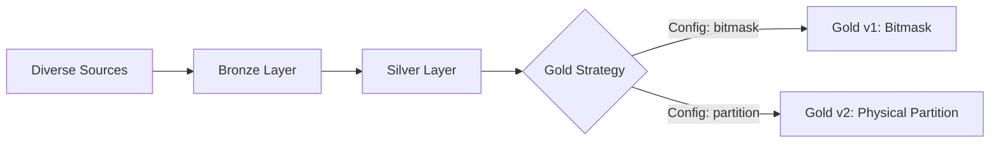

# Implementation Plan: Strategy-Based Consent Enforcement

**Date:** January 05, 2026  
**Status:** DRAFT  
**Approach:** Configurable Strategy Pattern

---

## Architecture Overview

### Shared Foundation (Bronze + Silver)
Both strategies share the same ingestion and cleaning pipeline:



### Strategy Selection
```yaml
# application.yml
consent:
  enforcement:
    strategy: "bitmask"  # or "partition"
```

---

## Phase 1: Shared Infrastructure (Bronze + Silver)

### 1.1 Docker Compose Setup

**Common Services:**
```yaml
services:
  minio:
    image: minio/minio
    ports: ["9000:9000", "9001:9001"]
    volumes: ["./data/minio:/data"]
    
  kafka:
    image: confluentinc/cp-kafka
    
  redis:
    image: redis:7-alpine
    
  postgres:
    image: postgres:15
    # For Iceberg catalog
    
  # Strategy-specific services added conditionally
```

**Deliverables:**
- [ ] `docker-compose.yml`
- [ ] MinIO bucket creation (bronze, silver, gold)
- [ ] Kafka topic creation (`telemetry.raw`, `consent.changed`)

---

### 1.2 Bronze Layer (Shared)

**Ingestion Service:**
```java
@RestController
public class IngestionController {
    
    @Value("${consent.enforcement.strategy}")
    private String strategy;
    
    @PostMapping("/api/ingest")
    public ResponseEntity<IngestResponse> ingest(@RequestBody TelemetryEvent event) {
        // 1. Validate
        validator.validate(event);
        
        // 2. Write to Bronze (MinIO) - SAME FOR BOTH
        String bronzePath = String.format("bronze/%s/%s/%s.json",
            event.getAthleteId(),
            LocalDate.now(),
            event.getTraceId());
        minioClient.putObject(bronzePath, event);
        
        // 3. Publish to Kafka - SAME FOR BOTH
        kafkaTemplate.send("telemetry.raw", event);
        
        return ResponseEntity.ok(new IngestResponse(event.getTraceId()));
    }
}
```

**Deliverables:**
- [ ] `IngestionController`
- [ ] MinIO client integration
- [ ] Kafka producer
- [ ] Schema validation

---

### 1.3 Silver Layer (Shared)

**Processing Job (Scheduled or Flink):**
```java
@Scheduled(fixedDelay = 30000)
public void processBronzeToSilver() {
    // 1. List new Bronze files
    List<String> newFiles = minioClient.listObjects("bronze/", lastProcessedTimestamp);
    
    for (String file : newFiles) {
        // 2. Read & Parse
        TelemetryEvent event = objectMapper.readValue(minioClient.getObject(file));
        
        // 3. Clean & Standardize - SAME FOR BOTH
        StandardizedEvent cleaned = cleaner.clean(event);
        
        // 4. Write to Silver - SAME FOR BOTH
        String silverPath = String.format("silver/athlete_id=%s/%s.json",
            cleaned.getAthleteId(),
            cleaned.getTimestamp());
        minioClient.putObject(silverPath, cleaned);
        
        // 5. Trigger Gold processing
        kafkaTemplate.send("silver.ready", cleaned);
    }
}
```

**Silver Schema (Common):**
```json
{
  "trace_id": "uuid",
  "athlete_id": "string",
  "timestamp": "iso8601",
  "activity": "string",
  "event_context": "string",
  "sport": "string",
  "metrics": {
    "heart_rate": 145,
    "blood_pressure_sys": 120,
    "oxygen_sat": 98,
    "power_watts": 250
  },
  "raw_json": "{...}"  // Original for replay
}
```

**Deliverables:**
- [ ] `SilverProcessingService`
- [ ] Data cleaner/standardizer
- [ ] Silver writer

---

## Phase 2: Consent Management (Shared)

### 2.1 Consent Rule API

**Common Endpoints:**
```java
@RestController
@RequestMapping("/api/consent")
public class ConsentController {
    
    @PostMapping("/rules")
    public ResponseEntity<ConsentRule> createRule(@RequestBody ConsentRule rule) {
        // 1. Validate rule
        // 2. Save to DB
        consentRepository.save(rule);
        
        // 3. Update Redis cache
        redisTemplate.opsForValue().set("consent:rule:" + rule.getUserId(), rule);
        
        // 4. Publish change event
        kafkaTemplate.send("consent.changed", new ConsentChangeEvent(rule, Action.GRANT));
        
        // 5. Strategy-specific processing
        goldStrategyService.handleConsentChange(rule);
        
        return ResponseEntity.ok(rule);
    }
}
```

**Deliverables:**
- [ ] `ConsentController`
- [ ] `ConsentRepository` (JPA)
- [ ] Redis integration
- [ ] Kafka event publisher

---

## Phase 3: Gold Layer - Strategy Pattern

### 3.1 Strategy Interface

```java
public interface GoldEnforcementStrategy {
    
    /**
     * Process a Silver record and write to Gold based on consent
     */
    void processRecord(StandardizedEvent event);
    
    /**
     * Handle consent rule changes (grant/revoke)
     */
    void handleConsentChange(ConsentChangeEvent event);
    
    /**
     * Query Gold data for a specific purpose
     */
    List<DataItem> query(QueryRequest request);
}
```

**Deliverables:**
- [ ] `GoldEnforcementStrategy` interface
- [ ] Strategy factory/selector

---

### 3.2 Strategy 1: Bitmask Approach (v1)

**Configuration:**
```yaml
consent:
  enforcement:
    strategy: "bitmask"
    bitmask:
      storage: "clickhouse"  # or "postgres"
```

**Implementation:**
```java
@Service
@ConditionalOnProperty(name = "consent.enforcement.strategy", havingValue = "bitmask")
public class BitmaskGoldStrategy implements GoldEnforcementStrategy {
    
    @Override
    public void processRecord(StandardizedEvent event) {
        // 1. Fetch consent rule
        ConsentRule rule = redis.get("consent:rule:" + event.getAthleteId());
        
        // 2. Calculate bitmask
        long mask = bitmaskGenerator.generate(rule);
        
        // 3. Write to Gold (ClickHouse/Postgres)
        GoldRecord record = GoldRecord.builder()
            .athleteId(event.getAthleteId())
            .timestamp(event.getTimestamp())
            .heartRate(event.getMetrics().getHeartRate())
            .consentMask(mask)  // The key field
            .build();
            
        goldRepository.save(record);
    }
    
    @Override
    public List<DataItem> query(QueryRequest request) {
        // Calculate required mask for the query
        long requiredMask = bitmaskGenerator.generateForQuery(request);
        
        // SQL: WHERE (consent_mask & requiredMask) = requiredMask
        return jdbcTemplate.query(
            "SELECT * FROM gold_data WHERE athlete_id = ? AND (consent_mask & ?) = ?",
            request.getAthleteId(), requiredMask, requiredMask
        );
    }
}
```

**Bitmask Generator:**
```java
@Service
public class BitmaskGenerator {
    
    // Static mapping
    private static final Map<String, Integer> BIT_MAP = Map.of(
        "purpose.research", 0,
        "purpose.marketing", 1,
        "activity.running", 5,
        "activity.cycling", 6,
        "metric.heart_rate", 10,
        "metric.blood_pressure", 11
    );
    
    public long generate(ConsentRule rule) {
        long mask = 0L;
        
        // Set bits for allowed purposes
        for (String purpose : rule.getAllowedPurposes()) {
            mask |= (1L << BIT_MAP.get("purpose." + purpose));
        }
        
        // Set bits for allowed activities
        for (String activity : rule.getAllowedActivities()) {
            mask |= (1L << BIT_MAP.get("activity." + activity));
        }
        
        return mask;
    }
}
```

**Limitations:**
- ✅ Fast for simple boolean consent (Purpose + Activity)
- ❌ Cannot handle value conditions (HR < 95)
- ❌ Cannot handle date ranges
- ❌ Limited to 64 dimensions

**Deliverables:**
- [ ] `BitmaskGoldStrategy`
- [ ] `BitmaskGenerator`
- [ ] ClickHouse schema & integration
- [ ] Query builder with bitwise operations

---

### 3.3 Strategy 2: Physical Partitioning (v2)

**Configuration:**
```yaml
consent:
  enforcement:
    strategy: "partition"
    partition:
      table-format: "iceberg"
      partition-keys: ["purpose", "activity", "event_context", "day"]
```

**Implementation:**
```java
@Service
@ConditionalOnProperty(name = "consent.enforcement.strategy", havingValue = "partition")
public class PartitionGoldStrategy implements GoldEnforcementStrategy {
    
    @Autowired
    private PolicyEngine policyEngine;  // OPA or custom
    
    @Override
    public void processRecord(StandardizedEvent event) {
        // 1. Fetch consent rule
        ConsentRule rule = redis.get("consent:rule:" + event.getAthleteId());
        
        // 2. Evaluate for ALL purposes
        for (String purpose : ALL_PURPOSES) {
            if (policyEngine.evaluate(event, purpose, rule)) {
                // 3. Write to purpose-specific partition
                String path = String.format(
                    "gold/active/purpose=%s/activity=%s/event=%s/date=%s/%s.parquet",
                    purpose,
                    event.getActivity(),
                    event.getEventContext(),
                    event.getTimestamp().toLocalDate(),
                    event.getTraceId()
                );
                
                icebergWriter.write(path, event);
            }
        }
    }
    
    @Override
    public List<DataItem> query(QueryRequest request) {
        // Build Iceberg query with partition pruning
        String sql = String.format(
            "SELECT * FROM gold_athlete_data WHERE purpose = '%s' AND activity = '%s'",
            request.getPurpose(),
            request.getActivity()
        );
        
        return trinoClient.execute(sql);
    }
}
```

**Policy Engine (Custom):**
```java
@Service
public class CustomPolicyEngine {
    
    public boolean evaluate(StandardizedEvent event, String purpose, ConsentRule rule) {
        // Check purpose
        if (!rule.getAllowedPurposes().contains(purpose)) {
            return false;
        }
        
        // Check activity
        if (rule.getActivityFilter() != null && 
            !rule.getActivityFilter().contains(event.getActivity())) {
            return false;
        }
        
        // Check value conditions
        if (rule.getMetricConditions() != null) {
            for (MetricCondition cond : rule.getMetricConditions()) {
                if (!evaluateCondition(event, cond)) {
                    return false;
                }
            }
        }
        
        // Check date range
        if (rule.getTimeRange() != null) {
            if (event.getTimestamp().isBefore(rule.getTimeRange().getStart()) ||
                event.getTimestamp().isAfter(rule.getTimeRange().getEnd())) {
                return false;
            }
        }
        
        return true;
    }
}
```

**Capabilities:**
- ✅ Supports N*N dimensions
- ✅ Handles value conditions (HR < 95)
- ✅ Handles date ranges
- ✅ Partition evolution
- ❌ Higher storage cost (duplication)

**Deliverables:**
- [ ] `PartitionGoldStrategy`
- [ ] `CustomPolicyEngine` or OPA integration
- [ ] Iceberg table setup
- [ ] Trino integration

---

## Phase 4: Query API (Strategy-Aware)

```java
@RestController
public class QueryController {
    
    @Autowired
    private GoldEnforcementStrategy strategy;  // Auto-injected based on config
    
    @GetMapping("/api/query")
    public ResponseEntity<QueryResponse> query(
        @RequestParam String athleteId,
        @RequestParam String purpose,
        @RequestParam(required = false) String activity
    ) {
        QueryRequest request = QueryRequest.builder()
            .athleteId(athleteId)
            .purpose(purpose)
            .activity(activity)
            .build();
            
        // Strategy handles the query logic
        List<DataItem> results = strategy.query(request);
        
        return ResponseEntity.ok(new QueryResponse(results));
    }
}
```

**Deliverables:**
- [ ] `QueryController`
- [ ] Strategy auto-wiring

---

## Phase 5: Dynamic Re-Indexing (Strategy-Specific)

### 5.1 Bitmask Strategy Re-Indexing

```java
@Override
public void handleConsentChange(ConsentChangeEvent event) {
    if (event.getAction() == Action.REVOKE) {
        // Recalculate mask (remove revoked purpose bit)
        long newMask = bitmaskGenerator.generate(event.getUpdatedRule());
        
        // Update all records for this athlete
        jdbcTemplate.update(
            "UPDATE gold_data SET consent_mask = ? WHERE athlete_id = ?",
            newMask, event.getAthleteId()
        );
    }
    // For GRANT, mask is updated on next write
}
```

### 5.2 Partition Strategy Re-Indexing

```java
@Override
public void handleConsentChange(ConsentChangeEvent event) {
    if (event.getAction() == Action.REVOKE) {
        // Delete partition
        String path = String.format("gold/active/purpose=%s/athlete_id=%s/",
            event.getPurpose(), event.getAthleteId());
        icebergCatalog.dropPartition(path);
        
    } else if (event.getAction() == Action.GRANT) {
        // Trigger backfill from Silver
        backfillService.reprocess(event.getAthleteId(), event.getPurpose());
    }
}
```

**Deliverables:**
- [ ] Bitmask update logic
- [ ] Partition delete/backfill logic

---

## Phase 6: Testing Both Strategies

### 6.1 Strategy Comparison Tests

```java
@SpringBootTest
public class StrategyComparisonTest {
    
    @Test
    public void testBitmaskStrategy() {
        // Set config
        System.setProperty("consent.enforcement.strategy", "bitmask");
        
        // Run test suite
        runConsentTests();
    }
    
    @Test
    public void testPartitionStrategy() {
        // Set config
        System.setProperty("consent.enforcement.strategy", "partition");
        
        // Run same test suite
        runConsentTests();
    }
    
    private void runConsentTests() {
        // 1. Ingest data
        // 2. Set consent
        // 3. Query
        // 4. Verify results
        // 5. Revoke consent
        // 6. Verify empty results
    }
}
```

**Deliverables:**
- [ ] Strategy-agnostic test suite
- [ ] Performance comparison report

---

## Implementation Phases

### Phase 1: Foundation (2 weeks)
- [ ] Docker Compose setup
- [ ] Bronze layer (Ingestion API)
- [ ] Silver layer (Processing)
- [ ] Consent API (CRUD)

### Phase 2: Strategy 1 - Bitmask (2 weeks)
- [ ] `BitmaskGoldStrategy`
- [ ] ClickHouse integration
- [ ] Query API
- [ ] Testing

### Phase 3: Strategy 2 - Partition (3 weeks)
- [ ] `PartitionGoldStrategy`
- [ ] Iceberg + Trino setup
- [ ] Policy Engine
- [ ] Query API
- [ ] Testing

### Phase 4: Comparison & Decision (1 week)
- [ ] Run both strategies in parallel
- [ ] Performance benchmarks
- [ ] Feature comparison
- [ ] Select primary strategy

**Total: 8 weeks**

---

## Strategy Comparison Matrix

| Feature | Bitmask (v1) | Partition (v2) |
|---------|--------------|----------------|
| **Simple Consent** (Purpose only) | ✅ Excellent | ✅ Excellent |
| **N*N Consent** (Multi-dimensional) | ❌ Limited (64 bits) | ✅ Unlimited |
| **Value Conditions** (HR < 95) | ❌ Not supported | ✅ Supported |
| **Date Ranges** | ❌ Not supported | ✅ Supported |
| **Query Performance** | ✅ Very Fast (indexed) | ✅ Very Fast (pruning) |
| **Storage Cost** | ✅ Low (single copy) | ⚠️ Higher (duplication) |
| **Re-Indexing Speed** | ✅ Fast (UPDATE query) | ⚠️ Slower (file operations) |
| **Scalability** | ✅ Millions of athletes | ✅ Millions of athletes |
| **Flexibility** | ❌ Fixed schema | ✅ Schema evolution |

---

## Recommendation

**Start with Bitmask (v1)** for:
- Simple consent models (Purpose + Activity)
- Faster time to market
- Lower infrastructure complexity

**Migrate to Partition (v2)** when:
- N*N consent requirements emerge
- Value conditions needed
- Buyer-specific data marts required

**Or run both** and route based on consent complexity:
```java
if (rule.hasComplexConditions()) {
    return partitionStrategy;
} else {
    return bitmaskStrategy;
}
```

---

## Next Steps

1. **Approve strategy approach**
2. **Implement Phase 1** (Shared foundation)
3. **Build Bitmask strategy first** (faster ROI)
4. **Evaluate** with real data
5. **Add Partition strategy** if needed
