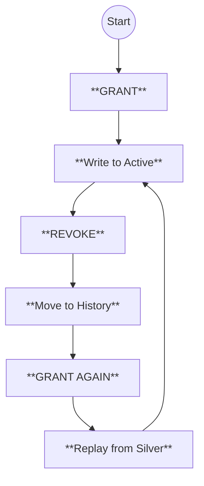
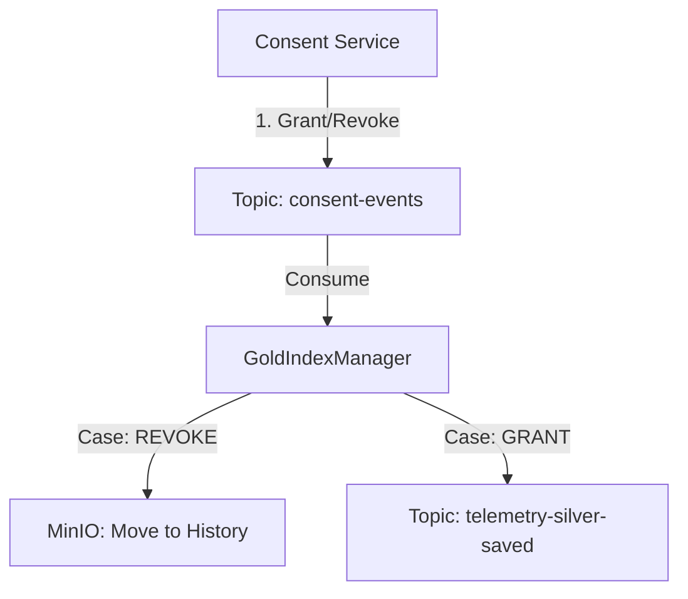

# Implementation Plan: Phase 2 - Physical Index Management (Consent Changes)
**Date:** January 01, 2026
**Previous Context:** `implementation_plan_2025_12_31.md`

## 1. Overview
We need to handle **Consent Changes (Revocation or Addition)** on the Gold Layer with a **Versioning/Soft Delete** strategy.

---

## 2. Definitions
*   **GRANT (Give Permission):** The athlete provides consent to use their data (e.g., for Research).
    *   **Result:** System puts data in the **Active Zone** (`gold/active/...`). Researchers **CAN** see it.
*   **REVOKE (Take Back Permission):** The athlete withdraws their consent.
    *   **Result:** System moves data to the **History Zone** (`gold/history/...`). Researchers **CANNOT** see it anymore.

---

## 3. Visualizing State Transitions

---

## 4. Architecture
*(Unchanged from previous version)*

---

## 5. Known Limitations & Risks (Self-Reflection)
Before verifying, we must acknowledge constraints in this POC design:

1.  **Race Conditions:** If a user hits GRANT and REVOKE within milliseconds, the `GoldIndexManager` (processing Revoke) and `GoldProcessor` (processing Replay) might conflict on the file system.
    *   *Mitigation:* POC assumes eventual consistency.
2.  **Volume:** "Replay from Silver" scans **all** historical data for that athlete. For 10 years of data, this is heavy.
    *   *Mitigation:* POC scope is small. Production would need Batch Jobs (Spark).
3.  **Atomicity:** MinIO does not support transactions. If "Move to History" fails halfway, we might have split data.
    *   *Mitigation:* Retry logic in Consumer.

---

## 6. Testing Strategy: Re-Indexing Verification
### A. Automated Logic (`DataFlowRevocationTestcontainersTest`)
1.  **Index Phase:** Seed Consent -> Ingest -> Verify `gold/active`.
2.  **Revoke Phase:** Publish Revoke -> Verify `gold/active` Empty -> Verify `gold/history`.
3.  **Re-Grant Phase:** Publish Grant -> Verify `gold/active` Populated.

### B. Manual Verification (`DataFlowRevocationManualTest`)
1.  **Ingest:** Run main -> Check MinIO.
2.  **Revoke:** Trigger Helper -> Check `gold/active` (Gone).
3.  **Grant:** Trigger Helper -> Check `gold/active` (Back).

---

## 7. Execution Checklist
- [ ] **Refactor:** `GoldService` -> `active/` prefix.
- [ ] **Feature:** `GoldIndexManager` (Move/Replay logic).
- [ ] **Test:** `DataFlowRevocationTestcontainersTest`.
- [ ] **Test:** `DataFlowRevocationManualTest`.
