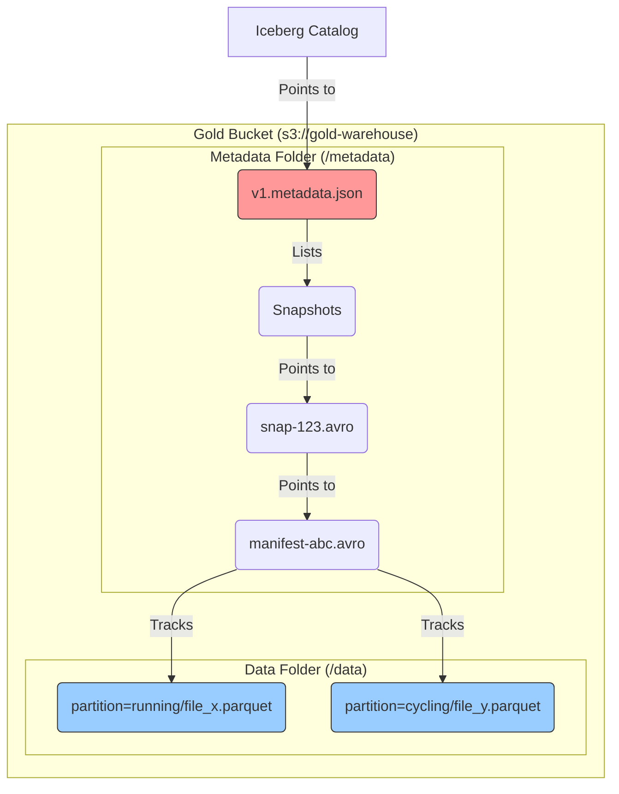

# Data Lake Physical Visualization

This document visualizes how data is physically stored in your Data Lake (MinIO) across the three Medallion layers.

## 1. High-Level Bucket Layout

Your data lake consists of three main storage buckets, representing the lifecycle of the data.

```mermaid
graph TD
    Ingest[Ingestion Source] --> B[(Bronze Bucket)]
    B --> S[(Silver Bucket)]
    S --> G[(Gold Bucket / Iceberg)]

    subgraph "MinIO Storage"
        B
        S
        G
    end

    style B fill:#cd7f32,stroke:#333 -- Bronze
    style S fill:#c0c0c0,stroke:#333 -- Silver
    style G fill:#ffd700,stroke:#333 -- Gold
```

---

## 2. Bronze & Silver Layers (Object Store)

In these layers, data is stored as raw or enriched JSON files organized by hierarchy.

```mermaid
graph LR
    subgraph "Bronze Bucket (run-bronze)"
        B_Root[/] --> B_Athlete[athlete_123/]
        B_Athlete --> B_File1[telemetry_trace_abc.json]
        B_Athlete --> B_File2[telemetry_trace_xyz.json]
    end

    subgraph "Silver Bucket (run-silver)"
        S_Root[/] --> S_Athlete[athlete_123/]
        S_Athlete --> S_File1[enriched_trace_abc.json]
        S_Athlete --> S_File2[enriched_trace_xyz.json]
    end

    style B_File1 fill:#fff,stroke:#333
    style S_File1 fill:#fff,stroke:#333
```

*   **Structure**: `bucket / athlete_id / filename`
*   **Format**: JSON
*   **Purpose**: Archival and Staging.

---

## 3. Gold Layer (Iceberg Table Structure)

The Gold layer is physically complex because it uses the **Apache Iceberg** table format. It splits data into a **Metadata Layer** (for ACID transactions) and a **Data Layer** (actual content).

### conceptual View


### Physical Folder Hierarchy (Gold)

If you looked inside the `gold-warehouse` bucket, you would see this physical structure:

```text
gold-warehouse/
└── gold/
    └── telemetry/
        ├── metadata/                             <-- THE "BRAIN"
        │   ├── v1.metadata.json                  (Defines schema, partitions, latest snapshot)
        │   ├── v2.metadata.json                  (Newer version after a commit)
        │   ├── snap-2938481092830.avro           (Manifest List for a specific snapshot)
        │   └── 3970-13-11100-999.avro            (Manifest File: lists data files)
        │
        └── data/                                 <-- THE "BODY"
            ├── purpose=research/
            │   └── activity_type=running/
            │       └── event_id=101/
            │           └── timestamp_day=2024-01-09/
            │               └── 00000-0-uuid.parquet  (Actual Columnar Data)
            │
            └── purpose=health/
                └── ...
```

### Key Takeaways for Gold Layer
1.  **Parquet**: The actual data is in `.parquet` files, which are highly compressed and columnar.
2.  **Partitioning**: The folders `purpose=research/...` are created automatically by Iceberg. This allows queries like `WHERE purpose='research'` to skip all other folders instantly (**Partition Pruning**).
3.  **Hidden Metadata**: You rarely touch the `metadata/` folder manually; the Iceberg library handles it to ensure transactions are safe.
