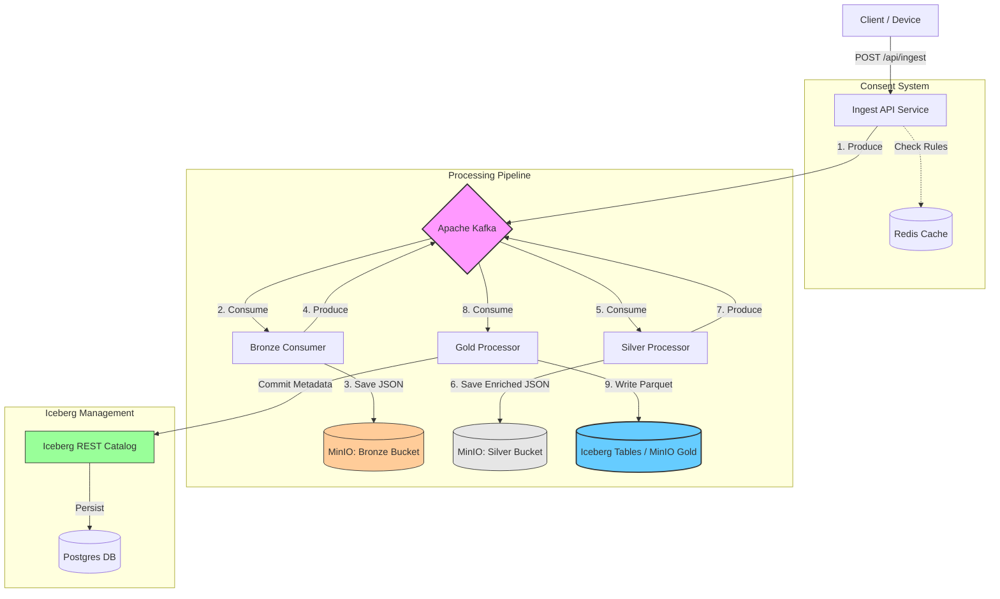

# Tech Stack & Architecture: Iceberg Data Lake POC

This document outlines the tools and technologies used in the **Iceberg Data Lake POC**, explaining the purpose of each component and how they fit into the overall architecture.

## 1. Technology Stack

### Core Framework
*   **Java 21**: The programming language used for the backend services.
*   **Spring Boot (3.4.0)**: The framework used to build the microservices. It handles dependency injection, REST APIs (`spring-boot-starter-web`), and integration with other systems.
*   **Lombok**: A library used to reduce boilerplate code (getters, setters, constructors) via annotations.

### Streaming & Messaging (The "Nervous System")
*   **Apache Kafka**: A distributed event streaming platform.
    *   **Purpose**: Decouples data ingestion from processing. It acts as a buffer and router, allowing the system to handle high throughput and providing fault tolerance.
    *   **Usage**: Data flows from `Ingest API` -> `Kafka Topic` -> `Consumers`.
*   **Spring Kafka**: The Spring integration for Kafka, simplifying the creation of Producers (sending messages) and Consumers (listeners).
*   **Zookeeper**: Used by Kafka for cluster coordination and state management.

### Data Lake Storage & Formats (The "Brain")
*   **Apache Iceberg (1.5.0)**: An open table format for huge analytic datasets.
    *   **Purpose**: Turns the "files" in the data lake into "tables" with SQL-like features. It supports ACID transactions, schema evolution, partition evolution, and time travel.
    *   **Usage**: The **Gold Layer** of the data lake is managed as Iceberg tables.
*   **MinIO**: High-performance, S3-compatible object storage.
    *   **Purpose**: Acts as the physical storage layer (replacing AWS S3 for local development).
    *   **Usage**: Stores the actual data files (JSON for Bronze/Silver, Parquet for Gold).
        *   **Bronze**: Raw ingestion data.
        *   **Silver**: Cleaned/Enriched data.
        *   **Gold**: Curated, partitioned Iceberg tables.
*   **Apache Parquet**: A columnar storage file format.
    *   **Purpose**: Optimized for analytics (fast reads, compression). Iceberg uses Parquet for its data files.
*   **Iceberg REST Catalog**: A lightweight catalog service.
    *   **Purpose**: Manages the *metadata* of Iceberg tables (tracking which files belong to which snapshot/version).
    *   **Usage**: The application talks to this catalog to commit transactions.
*   **PostgreSQL**: A relational database.
    *   **Purpose**: The backend storage for the Iceberg REST Catalog. It holds the pointers to the metadata files.

### Caching & State
*   **Redis**: An in-memory data store.
    *   **Purpose**: Fast lookups for **Consent Rules**.
    *   **Usage**: When data is ingested, the service checks Redis to check if the user has consented to specific data uses.

### Testing
*   **Testcontainers**: A library that spins up Docker containers for integration tests.
    *   **Purpose**: Allows running tests against *real* instances of Kafka, MinIO, Postgres, and Redis, rather than mocks.

---

## 2. System Architecture Visualization

### High-Level Architecture
The system follows a **Medallion Architecture** (Bronze -> Silver -> Gold).

### Data Flow Breakdown

1.  **Ingestion (API)**: Receives telemetry data. Validates minimal structure. Checks **Redis** for active consent. If valid, sends to Kafka `ingest` topic.
2.  **Bronze Layer (Raw)**:
    *   **Goal**: Immutable history.
    *   Consumer reads from `ingest`.
    *   Saves raw JSON payload to **MinIO** (`run-bronze/...`).
    *   Emits event: "Data Saved to Bronze".
3.  **Silver Layer (Enriched)**:
    *   **Goal**: Cleaned, verified data.
    *   Consumer reads "Bronze Saved" event.
    *   Performs validation, enrichment (e.g., standardizing units).
    *   Saves enriched JSON to **MinIO** (`run-silver/...`).
    *   Emits event: "Data Saved to Silver".
4.  **Gold Layer (Curated)**:
    *   **Goal**: Analytics-ready, high-performance tables.
    *   Consumer reads "Silver Saved" event.
    *   **Fan-Out Logic**: Checks Consent Rules again.
    *   Writes data as **Parquet** files to **MinIO** (`run-gold/...`).
    *   Commits the transaction to the **Iceberg Catalog**, making the data visible to queries.

## 3. Why This Stack?

| Component | Why we chose it? |
| :--- | :--- |
| **Iceberg** | Solves the "small files problem", allows safe concurrent writes, and enables "Time Travel" (querying data as it was 5 mins ago). Essential for reliable data lakes. |
| **MinIO** | Gives you a full S3 experience locally. You can swap this for AWS S3 in production with zero code changes. |
| **Kafka** | Ensures that if the processing layer crashes, no data is lost (it stays in the queue). Allows scaling consumers independently. |
| **Testcontainers** | Ensures that "it works on my machine" means it actually works. No more mocking complex external services. |
